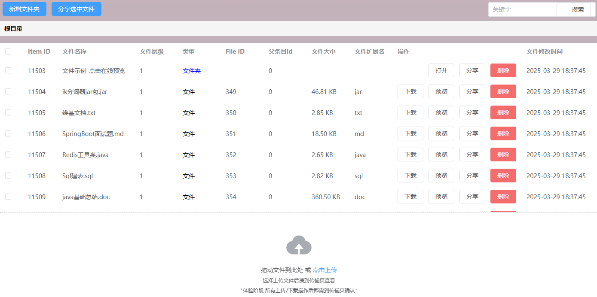

# :cloud: Cloud Drive - Backend

**Cloud Drive** 云存储服务 **后端** 服务端

> Cloud Drive 是一款基于网页的云存储应用，重现了现代主流云存储服务的大部分常用功能。用户借助它能够轻松存储、访问、管理和分享各类文件，涵盖文档、照片、视频、音乐以及压缩文件等。只需通过网页浏览器，就可以在不同地点和设备上管理这些文件。

<b>在线体验👉：[https://cloud.softspark.cn](https://cloud.softspark.cn)</b> *\*本项目持续开发中，故可能不定期维护。*可直接访问下方 **:computer: 功能演示** 预览效果。

<b>项目前端:link:：[https://github.com/AsihanBit/cloud-drive-frontend](https://github.com/AsihanBit/cloud-drive-frontend)</b>

# 🛠️ 架构

文件上传/续传/秒传 实现：

ElasticSearch 文件搜索：实现关键字高亮 (match highlight)。

kkFileView 在线浏览：

# :computer: 功能演示

### 🔒 用户权限

使用 JWT 实现用户认证和权限控制。

| 登录表单                                                     | 响应 | 存储 |
| :------------------------------------------------------------: | :----: | :----: |
|  |   |  |

### :file_folder: 空间管理

用户可以按层级管理存储文件，采用了树形邻接表存储目录信息。

|                           文件列表                           |
| :----------------------------------------------------------: |
|  |

*\*用户新注册账户后，会有一些默认示例文件*

### 🌐 文件传输

Web Worker 进行文件分片，支持分片并发上传，暂停，续传，秒传等。

| 上传 | 下载 |
| :----: | :----: |
|  |  |

*\*现阶段 上传每个分片文件时大小为 500KB，下载文件时每次请求5MB。*

### 🔍 文件搜索

实现了ElasticSearch 搜索，关键字高亮显示 (match highlight) 。

|                          搜索 "文"                           |                         搜索 "java"                          |
| :----------------------------------------------------------: | :----------------------------------------------------------: |
|  |  |

### 📄 在线浏览

集成了 kkFileView 可以浏览多数格式文件（逐步完善中）。

| 文本                                                         | 图片 | Office 文档 |
| :------------------------------------------------------------: | :----: | :-----------: |
|  | png  ico  (本网站图标) | doc  pdf  |

| 代码 | jar  | 压缩包 |
| :----: | :----: | :------: |
| java  xml  |  |  |

### :mailbox_with_mail: 文件分享

支持多个 文件/文件夹 分享，转存。分享码采用 AES 对称加密，保障用户群体分享的资源不会被爬取。

| 分享文件 | 分享链接 | 转存文件 |
| :--------: | :--------: | :--------: |
| **分享框**  *\*此处两个参数暂未启用* **分享成功-生成链接**  **分享列表**  可以重置分享有效期，访问次数 | **使用分享链接**  **可以选择文件转存**  | **使用分享链接**  **用户自身文件无需转存**  **转存可选择指定目录**  *\*若想体验转存功能，可再注册新账户* *在'分享'->'最近转存'->'使用分享码'使用刚才的分享链接* |

### 💬 ··· 更多功能开发中 ···

# :whale: 部署

本项目使用 Docker 容器化部署所有服务：

# 🔔 其他说明

### :chart_with_upwards_trend: 进度

项目处于开发阶段，各项功能仍在开发中。

### :vibration_mode: 适配

**\*主要对 PC Web端开发，目前仅登录页面适配了移动端\***

# :pray: 鸣谢

[redis-windows](https://github.com/redis-windows/redis-windows)

[ARDM](https://github.com/qishibo/AnotherRedisDesktopManager)

[ElasticSearch](https://github.com/elastic/elasticsearch)

[es-client](https://github.com/q2316367743/es-client)

[analysis-ik](https://github.com/infinilabs/analysis-ik)

[kkFileView](https://github.com/kekingcn/kkFileView/tree/master)：[kkfileview-base](https://github.com/kekingcn/kkFileView/tree/master/docker/kkfileview-base)

